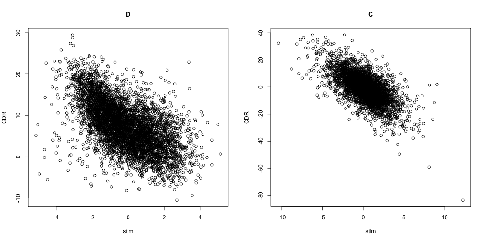

We look at GO enrichment of DE genes using MAST, with and without CDR and compare it to GO enrichment of DE genes using other RNASeq tools. 

We compare the ratio of immune specific to non-specific enriched modules.

We'll use GO.db and org.Hs.eg.db for the MAIT cells.

We'll use the the hypergeometric for testing enrichment. 

We load the results and databases.


```r
library(data.table)
library(plyr)
library(GO.db)
```

```
## Loading required package: AnnotationDbi
```

```
## Warning: package 'AnnotationDbi' was built under R version 3.2.2
```

```
## Loading required package: stats4
## Loading required package: BiocGenerics
```

```
## Warning: package 'BiocGenerics' was built under R version 3.2.2
```

```
## Loading required package: parallel
## 
## Attaching package: 'BiocGenerics'
## 
## The following objects are masked from 'package:parallel':
## 
##     clusterApply, clusterApplyLB, clusterCall, clusterEvalQ,
##     clusterExport, clusterMap, parApply, parCapply, parLapply,
##     parLapplyLB, parRapply, parSapply, parSapplyLB
## 
## The following objects are masked from 'package:stats':
## 
##     IQR, mad, xtabs
## 
## The following objects are masked from 'package:base':
## 
##     anyDuplicated, append, as.data.frame, as.vector, cbind,
##     colnames, do.call, duplicated, eval, evalq, Filter, Find, get,
##     grep, grepl, intersect, is.unsorted, lapply, Map, mapply,
##     match, mget, order, paste, pmax, pmax.int, pmin, pmin.int,
##     Position, rank, rbind, Reduce, rep.int, rownames, sapply,
##     setdiff, sort, table, tapply, union, unique, unlist, unsplit
## 
## Loading required package: Biobase
## Welcome to Bioconductor
## 
##     Vignettes contain introductory material; view with
##     'browseVignettes()'. To cite Bioconductor, see
##     'citation("Biobase")', and for packages 'citation("pkgname")'.
## 
## Loading required package: IRanges
```

```
## Warning: package 'IRanges' was built under R version 3.2.2
```

```
## Loading required package: S4Vectors
```

```
## Warning: package 'S4Vectors' was built under R version 3.2.2
```

```
## Warning in .recacheSubclasses(def@className, def, doSubclasses, env):
## undefined subclass "externalRefMethod" of class "expressionORfunction";
## definition not updated
```

```
## 
## Attaching package: 'S4Vectors'
## 
## The following object is masked from 'package:plyr':
## 
##     rename
```

```
## Warning in .recacheSubclasses(def@className, def, doSubclasses, env):
## undefined subclass "externalRefMethod" of class "functionORNULL";
## definition not updated
```

```
## 
## Attaching package: 'IRanges'
## 
## The following object is masked from 'package:data.table':
## 
##     shift
## 
## The following object is masked from 'package:plyr':
## 
##     desc
## 
## Loading required package: DBI
```

```r
library(stringr)
library(grid)
library(gridExtra)
library(ggplot2)
```

```
## Find out what's changed in ggplot2 with
## news(Version == "1.0.1", package = "ggplot2")
```

```r
library(mHG)
library(org.Hs.eg.db)
```

```
## 
```

```r
library(org.Mm.eg.db)
```

```
## 
```

```r
#diffex = readRDS("../inst/extdata/method_comp_logfc_qvalue.rds")
diffex = readRDS("../inst/extdata/comb_fdr_logfc.rds")

g_legend<-function(a.gplot){
  tmp <- ggplot_gtable(ggplot_build(a.gplot))
  leg <- which(sapply(tmp$grobs, function(x) x$name) == "guide-box")
  legend <- tmp$grobs[[leg]]
  return(legend)}
```


```r
goterms = select(org.Hs.eg.db,diffex[,primerid],"GO","ENTREZID")
```

```
## 'select()' returned 1:many mapping between keys and columns
```

```r
setDT(goterms)
goterms = goterms[ONTOLOGY%in%"BP"]
#only experimental evidence
goterms = goterms[EVIDENCE%in%c("EXP","IDA","IPI","IMP","IGI","IEP")]
unique.go = goterms[,unique(ENTREZID),.(GO)]
terms = select(GO.db,columns = c("GOID","TERM"),unique(goterms$GO))
```

```
## 'select()' returned 1:1 mapping between keys and columns
```

```r
setnames(unique.go,"GO","GOID")
setnames(unique.go,"V1","ENTREZID")
setDT(terms)
terms = unique(terms)
unique.go = unique(unique.go)
unique.go = merge(unique.go,terms,by="GOID")
unique.go[,N:=length(ENTREZID),.(GOID)]
offspring = GOBPOFFSPRING[["GO:0002376"]]
```


```r
setnames(diffex,"primerid","ENTREZID")
thresholds = c(0.01,0.05,0.1)
prob_thresh=0.01
NN = length(unique(unique.go$ENTREZID))
methods = c("zlm_fdr","zlm_ng_fdr","zlm_fix_fdr","zlm_fix_ng_fdr","limma_fdr","limma_fdr","limma_ng_fdr","deseq_fdr","deseq_ng_fdr","edger_fdr","edger_ng_fdr","scde_fdr")
loops = expand.grid(thresholds,methods)
thresh=0.05

meth="zlm_ng_fdr"
results = apply(loops,1,function(looprow){
  thresh = looprow[1]
  meth = as.character(looprow[2])
  fc = gsub("fdr","log2fc",meth)
  res = unique.go[ENTREZID%in%diffex[get(meth)<thresh&abs(get(fc))>log2(1.25),ENTREZID]][,.(prob = 1-phyper(q=length(ENTREZID),m = N, n = NN-N,k = length(diffex[get(meth)<thresh,ENTREZID])),TERM,N,hit = length(ENTREZID)),.(GOID)]
 nr.imm = length(unique(res)[GOID%in%offspring&p.adjust(prob,"fdr")<prob_thresh,GOID]) 
nr.tot = length(unique(res)[p.adjust(prob,"fdr")<prob_thresh,GOID])
data.frame(thresh,meth,nr.imm,nr.tot,nr.imm/nr.tot)
})
```


## Plot of the rate of detection of enriched immune GO terms vs FDR threshold for DE genes across different methods.


```r
results_r = ldply(results)
setDT(results_r)
results_r[,meth:=gsub("zlm_fix","zlmfix",meth)]
results_r[,rate := nr.imm/nr.tot]
results_r[,thresh:=as.numeric(as.character(thresh))]
results_r[,method_global := str_split_fixed(meth,"_",3)[,1]]
results_r[,withng := factor(str_split_fixed(meth,"_",3)[,2],labels=c("No CDR control","CDR control"))]
p1 = ggplot(results_r[!(method_global%in%"zlmfix")])+aes(x=thresh,y=rate,color=method_global)+geom_point()+geom_line()+scale_x_continuous("FDR Threshold")+scale_y_continuous("Proportion of Immune\nSpecific GO Modules")+facet_wrap(~withng)+scale_color_brewer("Method",palette = 2,type="qual",limits=c("limma","zlm","deseq","edger","scde"),labels=c("Limma","MAST","DESeq","EdgeR","SCDE"))+theme_gray()
leg = g_legend(p1)
p1
```

 


## mDC

```r
diffex.mdc = readRDS("../inst/extdata/method_comp_logfc_qvalue_mDC.rds")
setnames(diffex.mdc,"primerid","SYMBOL")
diffex.mdc$SYMBOL=gsub("^(.)","\\U\\1",tolower(diffex.mdc$SYMBOL),perl=TRUE)
goterms = select(org.Mm.eg.db,diffex.mdc[,SYMBOL],"GO","SYMBOL")
setDT(goterms)
goterms = goterms[ONTOLOGY%in%"BP"]
#only experimental evidence
goterms = goterms[EVIDENCE%in%c("EXP","IDA","IPI","IMP","IGI","IEP")]
unique.go = goterms[,unique(SYMBOL),.(GO)]
terms = select(GO.db,columns = c("GOID","TERM"),goterms$GO)
setnames(unique.go,"GO","GOID")
setnames(unique.go,"V1","SYMBOL")
setDT(terms)
terms = unique(terms)
unique.go = unique(unique.go)
unique.go = merge(unique.go,terms,by="GOID")
unique.go[,N:=length(SYMBOL),.(GOID)]
NN=length(unique(unique.go[,SYMBOL]))
```


## GO enrichment using hypergeometric for mDC.

```r
thresholds = c(0.01,0.05,0.1)
prob_thresh=0.01
methods = c("fdr_lma_2_wo","fdr_lma_2_ng","fdr_zlm_2_wo","fdr_zlm_2_ng","fdr_lma_4_wo","fdr_lma_4_ng","fdr_zlm_4_wo","fdr_zlm_4_ng","fdr_lma_6_wo","fdr_lma_6_ng","fdr_zlm_6_wo","fdr_zlm_6_ng")
loops = expand.grid(thresholds,methods)
results.mdc = apply(loops,1,function(looprow){
  thresh = looprow[1]
  meth = as.character(looprow[2])
  fc = gsub("fdr","logFC",meth)
    res = unique.go[SYMBOL%in%diffex.mdc[get(meth)<thresh&abs(get(fc))>log2(1.25),SYMBOL]][,.(prob = 1-phyper(q=length(SYMBOL),m = N, n = NN-N,k = length(diffex.mdc[get(meth)<thresh,SYMBOL])),TERM,N,hit = length(SYMBOL)),.(GOID)]

nr.imm = length(unique(res)[GOID%in%offspring&p.adjust(prob,"fdr")<prob_thresh,GOID]) 

nr.tot = length(unique(res)[p.adjust(prob,"fdr")<prob_thresh,GOID])
data.frame(thresh,meth,nr.imm,nr.tot,nr.imm/nr.tot)
})
```


```r
results.mdc_r = ldply(results.mdc)
setDT(results.mdc_r)
results.mdc_r[,thresh:=as.numeric(as.character(thresh))]
results.mdc_r[,method_global := str_split_fixed(meth,"_",4)[,2]]
results.mdc_r[,time := str_split_fixed(meth,"_",4)[,3]]
results.mdc_r[,withng := factor(str_split_fixed(meth,"_",4)[,4],labels=c("No CDR control","CDR control"))]
results.mdc_r = results.mdc_r[,rate := mean(nr.imm)/(nr.tot),]
results.mdc_r=results.mdc_r[,.(rate = mean(rate)),.(withng,method_global,thresh)]
p2 = ggplot(results.mdc_r)+aes(x=thresh,y=rate,color=method_global)+geom_point()+geom_line()+scale_x_continuous("FDR Threshold")+scale_y_continuous("Proportion of Immune\nSpecific GO Modules")+facet_grid(~withng)+scale_color_brewer("Method",palette = 2,type="qual",limits=c("lma","zlm"),labels=c("Limma","MAST"))+theme_gray()
```


```r
library(grid)
p3 = grid.arrange(arrangeGrob(p1+theme(legend.position="none"),p2+theme(legend.position="none"),nrow=2),leg,nrow=1,widths=c(10,2))
pdf(file="../inst/extdata/output/SuppFig_10.pdf",width=6,height=8)
p3
grid.draw(p3)
grid.text(c("A","B"),x=c(0.01,0.01),y=c(0.95,0.55))
dev.off()
```


```r
pdf(file="../inst/extdata/output/SuppFig_10_a.pdf",width=6,height=4)
p1
dev.off()
```

```
## quartz_off_screen 
##                 2
```

### GSEA of GO BP Modules in mDC


```r
library(RamiGO)
data("c5.go.mapping")
gsea_go = readRDS("../inst/extdata/gsea_result_mDC.rds")
gomap = melt(sapply(gsea_go$module,function(x)c5.go.mapping[match(x,c5.go.mapping[,1]),2]))
gomap = cbind(rownames(gomap),gomap)
colnames(gomap) =c("TERM","GOID")
setDT(gomap)
setnames(gsea_go,"module","TERM")
gsea_go = merge(gsea_go_ids,gsea_go,by="TERM")
setnames(gsea_go,gsub("zlm_fix","zlmfix",colnames(gsea_go)))
gsea_go = melt(gsea_go,id=c("TERM","GOID"))
gsea_go = cbind(gsea_go,data.table((gsea_go[,str_split_fixed(variable,"_",5)])))
setnames(gsea_go,c("V1","V2","V3","V4","V5"),c("V1","Time","signif","Method","ng"))
gsea_go[,V1:=NULL]
ggplot(ldply(lapply(c(0.01,0.05,0.1),function(x){
cbind(gsea_go[signif%in%"FDR",.(sum(GOID%in%offspring&value<substitute(eval(x)))/sum(value<substitute(eval(x) ))),.(Method,ng)],thresh=x)[,ng:=factor(ng,levels=c("","ng"),labels=c("No CDR","With CDR"))]
})))+aes(x=thresh,y=V1,color=Method)+facet_wrap(~ng)+geom_line()+geom_point()+scale_x_continuous("FDR Threshold")+scale_color_brewer("Method",palette = 2,type="qual",limits=c("limma","zlm","zlmfix"),labels=c("Limma","MAST","MAST (fixed threshold)"))+scale_y_continuous("Proportion of Enriched\nImmune Specific GO BP Modules")
```

### GSEA of GO BP Modules Enriched in MAIT


```r
gsea_go = readRDS("../inst/extdata/gsea_result.rds")
gomap = melt(sapply(gsea_go$module,function(x)c5.go.mapping[match(x,c5.go.mapping[,1]),2]))
gomap = cbind(rownames(gomap),gomap)
colnames(gomap) =c("TERM","GOID")
setDT(gomap)
setnames(gsea_go,"module","TERM")
gsea_go = merge(gsea_go_ids,gsea_go,by="TERM")
setnames(gsea_go,gsub("zlm_fix","zlmfix",colnames(gsea_go)))
gsea_go = melt(gsea_go,id=c("TERM","GOID"))
gsea_go = cbind(gsea_go,data.table((gsea_go[,str_split_fixed(variable,"_",3)])))
setnames(gsea_go,c("V1","V2","V3"),c("var","Method","ng"))
ggplot(ldply(lapply(c(0.01,0.05,0.1),function(x){
cbind(gsea_go[var%in%"FDR",.({foo=sum(GOID%in%offspring&value<substitute(eval(x)))/sum(value<substitute(eval(x) ));ifelse(is.nan(foo),0,foo)}),.(Method,ng)],thresh=x)[,ng:=factor(ng,levels=c("","ng"),labels=c("No CDR","With CDR"))]
})))+aes(x=thresh,y=V1,color=Method)+facet_wrap(~ng)+geom_line(alpha=0.7)+geom_point(alpha=0.7)+scale_x_continuous("FDR Threshold")+scale_color_brewer("Method",palette = 2,type="qual")+scale_y_continuous("Proportion of Enriched Immune\nSpecific GO BP Modules")
```

# Simulation study


```r
library(abind)
library(arm)
```

```
## Loading required package: MASS
## 
## Attaching package: 'MASS'
## 
## The following object is masked from 'package:AnnotationDbi':
## 
##     select
## 
## Loading required package: Matrix
## 
## Attaching package: 'Matrix'
## 
## The following object is masked from 'package:IRanges':
## 
##     expand
## 
## Loading required package: lme4
## 
## arm (Version 1.8-6, built: 2015-7-7)
## 
## Working directory is /Users/gfinak/Dropbox (Gottardo Lab)/GoTeam/Projects/Paper-ZLM/MASTDataPackage/vignettes
```

```r
library(data.table)
library(ggplot2)
library(grid)
library(devtools)
#install_github("RGlab/MAST")
library(MAST)
```

```
## Loading required package: reshape
## 
## Attaching package: 'reshape'
## 
## The following object is masked from 'package:Matrix':
## 
##     expand
## 
## The following object is masked from 'package:IRanges':
## 
##     expand
## 
## The following object is masked from 'package:S4Vectors':
## 
##     rename
## 
## The following objects are masked from 'package:reshape2':
## 
##     colsplit, melt, recast
## 
## The following object is masked from 'package:data.table':
## 
##     melt
## 
## The following objects are masked from 'package:plyr':
## 
##     rename, round_any
```

```
## Warning: replacing previous import by 'reshape::melt' when loading 'MAST'
```

```
## 
## Attaching package: 'MAST'
## 
## The following object is masked from 'package:arm':
## 
##     se.coef
## 
## The following object is masked from 'package:ggplot2':
## 
##     layer
## 
## The following object is masked from 'package:stats':
## 
##     filter
```

```r
library(mvtnorm)
library(GSEABase)
```

```
## Loading required package: annotate
```

```
## Warning: package 'annotate' was built under R version 3.2.1
```

```
## Loading required package: XML
## Loading required package: graph
## 
## Attaching package: 'graph'
## 
## The following object is masked from 'package:XML':
## 
##     addNode
## 
## The following object is masked from 'package:stringr':
## 
##     boundary
## 
## The following object is masked from 'package:plyr':
## 
##     join
```

```r
library(limma)
```

```
## Warning: package 'limma' was built under R version 3.2.2
```

```
## 
## Attaching package: 'limma'
## 
## The following object is masked from 'package:arm':
## 
##     read.columns
## 
## The following object is masked from 'package:BiocGenerics':
## 
##     plotMA
```

```r
library(MCMCpack)
```

```
## Loading required package: coda
## 
## Attaching package: 'coda'
## 
## The following object is masked from 'package:arm':
## 
##     traceplot
## 
## ##
## ## Markov Chain Monte Carlo Package (MCMCpack)
## ## Copyright (C) 2003-2015 Andrew D. Martin, Kevin M. Quinn, and Jong Hee Park
## ##
## ## Support provided by the U.S. National Science Foundation
## ## (Grants SES-0350646 and SES-0350613)
## ##
```

```r
library(pheatmap)
library(GGally)
library(RColorBrewer)
library(reshape2)
library(AnnotationDbi)
library(TxDb.Hsapiens.UCSC.hg19.knownGene)
```

```
## Loading required package: GenomicFeatures
```

```
## Warning: package 'GenomicFeatures' was built under R version 3.2.2
```

```
## Loading required package: GenomeInfoDb
```

```
## Warning: package 'GenomeInfoDb' was built under R version 3.2.2
```

```
## Loading required package: GenomicRanges
```

```
## Warning: package 'GenomicRanges' was built under R version 3.2.2
```


## For portability, all the time consuming steps are not evaluated.
## Please set ALL the eval flag in the knitr chunks to TRUE before running the code.


### fit ZLM


# read fit ZLM result


###  The estimated parameters in MAIT

 

###  The estimated stimulation and cdr coefficient in MAIT

 

  


###  ROC 

 
