# Stimulated vs. Non-stimulated MAIT Cells


```r
# library(devtools)
# install_git("http://github.fhcrc.org/gottardo-r/MASTDataPackage")
# install_git('http://github.com/RGLab/MAST')
```


### ZLM results


We observe 1413 differentially expressed genes without the CDR effect in the model, and 291 with the CDR effect.

### Analysis of deviance for ngeneson (Supplementary Figure 4)


```
## Mean % Deviance
```


|Dataset |Component  |       V1|
|:-------|:----------|--------:|
|DC      |Continuous | 1.883218|
|DC      |Discrete   | 5.238081|
|MAIT    |Continuous | 4.481143|
|MAIT    |Discrete   | 5.552008|

```
## % Deviance 90th Percentile
```


|Dataset |Component  |      90%|
|:-------|:----------|--------:|
|DC      |Continuous |  5.08754|
|DC      |Discrete   | 10.11620|
|MAIT    |Continuous | 11.97647|
|MAIT    |Discrete   | 13.89787|

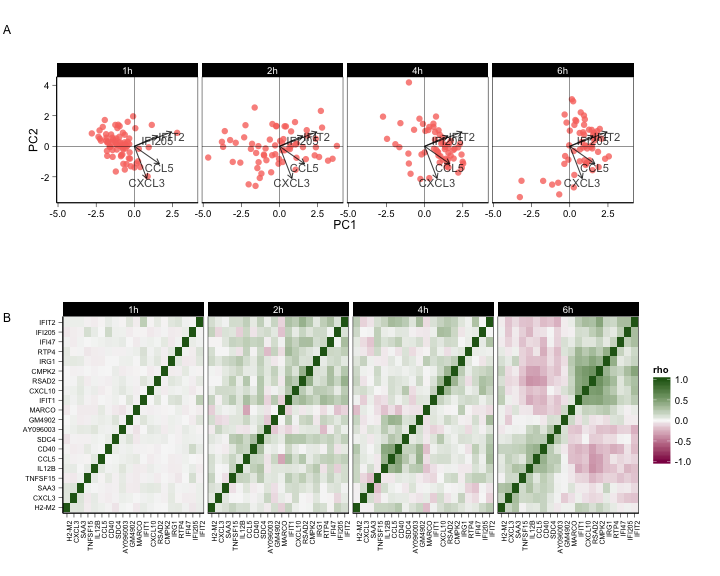 

### Visualization of most differentially expressed genes

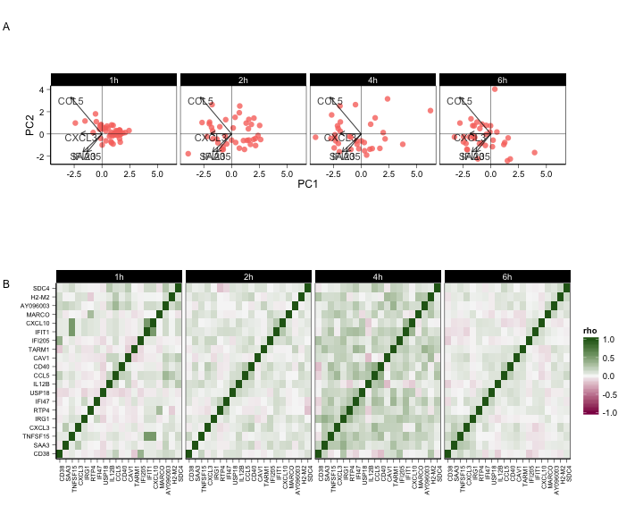 

## Heatmap of MAITs based on most differentially expressed genes

Top 100 DE genes between stimulated and non-stimulated MAIT cells. 

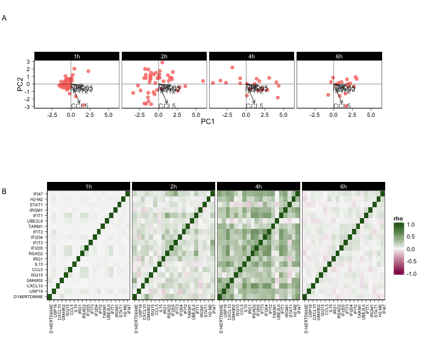 

Some of the activated MAITs have transcriptional profiles more similar to unactivated MAITS.

### GSEA


<!-- ### Visualization of most enriched modules -->

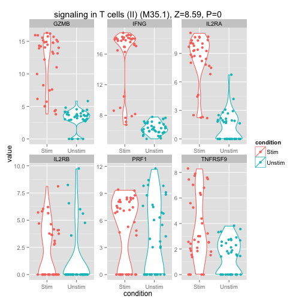 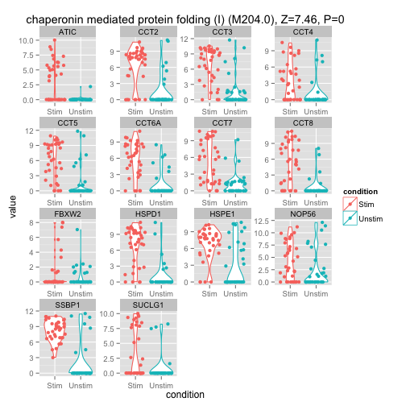 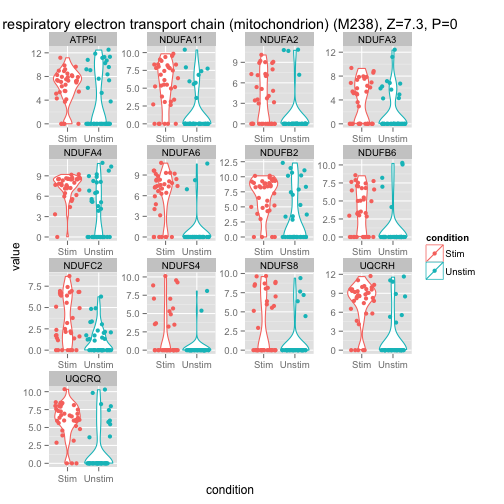 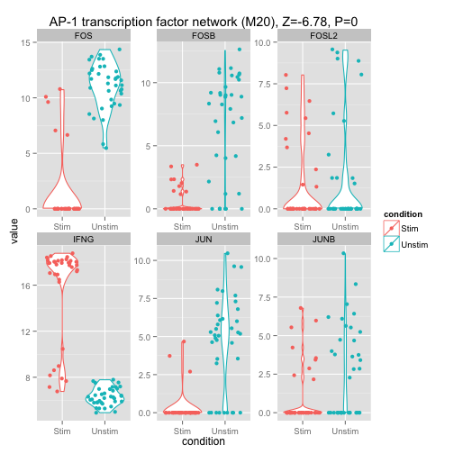  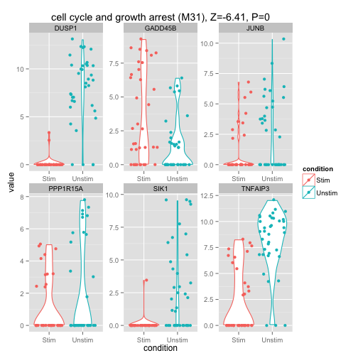 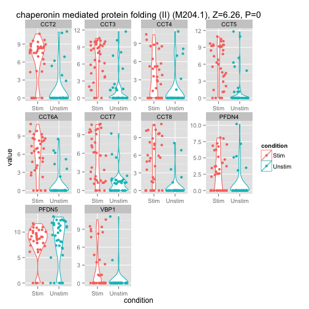 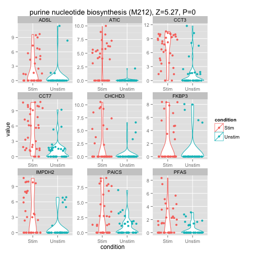 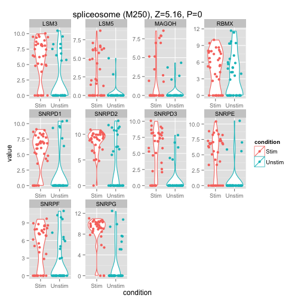 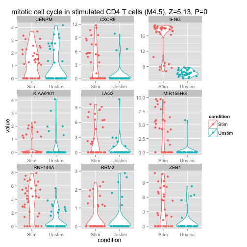 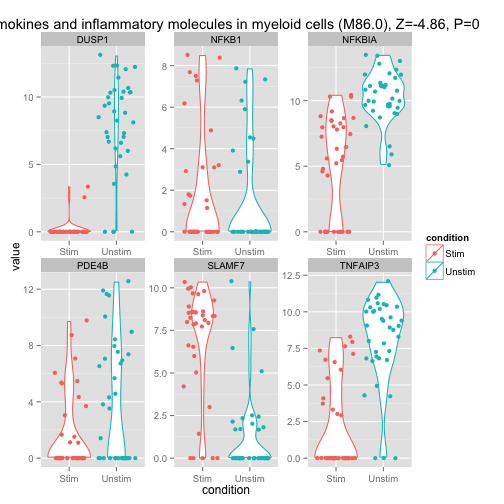 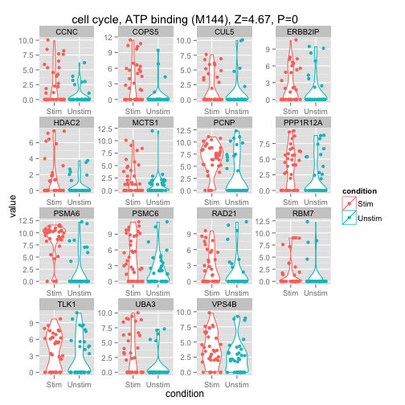 

<!-- ### Visualization of module "scores" for stimulated and unstimulated cells -->


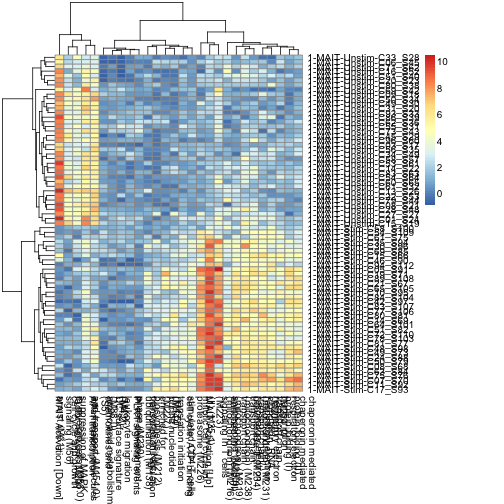 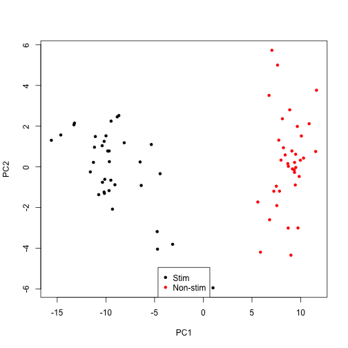 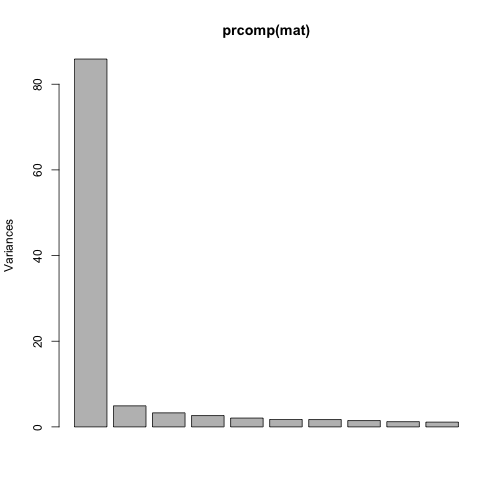 

```
##                                             MAIT Activation [Up] 
##                                                     -0.387170846 
##                                                proteasome (M226) 
##                                                     -0.314344244 
##                               signaling in T cells\n(II) (M35.1) 
##                                                     -0.284029888 
##               chaperonin mediated\nprotein folding (I)\n(M204.0) 
##                                                     -0.234708751 
##                                               spliceosome (M250) 
##                                                     -0.217178180 
##              chaperonin mediated\nprotein folding (II)\n(M204.1) 
##                                                     -0.210692830 
##    respiratory electron\ntransport chain\n(mitochondrion) (M238) 
##                                                     -0.208280866 
##    respiratory electron\ntransport chain\n(mitochondrion) (M219) 
##                                                     -0.177130940 
##             transcription\nelongation, RNA\npolymerase II (M234) 
##                                                     -0.174683974 
##    respiratory electron\ntransport chain\n(mitochondrion) (M216) 
##                                                     -0.174110960 
##                                   translation initiation\n(M227) 
##                                                     -0.164768496 
##    respiratory electron\ntransport chain\n(mitochondrion) (M231) 
##                                                     -0.160812206 
##                           purine nucleotide\nbiosynthesis (M212) 
##                                                     -0.158058288 
##                                  cell cycle, ATP binding\n(M144) 
##                                                     -0.140281755 
##            mitotic cell cycle in\nstimulated CD4 T cells\n(M4.5) 
##                                                     -0.139886692 
##                              enriched for\nubiquitination (M138) 
##                                                     -0.111525790 
##                                 enriched in T cells (II)\n(M223) 
##                                                     -0.105794697 
##                                cell cycle, mitotic\nphase (M230) 
##                                                     -0.104908401 
##                   amino acid metabolishm\nand transport (M154.0) 
##                                                     -0.009385202 
##                                       DC surface signature\n(S5) 
##                                                      0.002800602 
##                                    PLK1 signaling events\n(M4.2) 
##                                                      0.003366226 
##                                     leukocyte migration\n(M88.0) 
##                                                      0.011845211 
##             transcription regulation\nin cell development\n(M49) 
##                                                      0.022981175 
##                         AP-1 transcription\nfactor network (M20) 
##                                                      0.132958000 
## chemokines and\ninflammatory molecules\nin myeloid cells (M86.0) 
##                                                      0.145395140 
##                             suppression of MAPK\nsignaling (M56) 
##                                                      0.146310102 
##                              cell cycle and growth\narrest (M31) 
##                                                      0.173068169 
##                                           MAIT Activation [Down] 
##                                                      0.381515808
```


<!-- ### Module heatmap of discrete, continuous and combined -->


### Figure 4 GSEA Results for MAIT Data Set

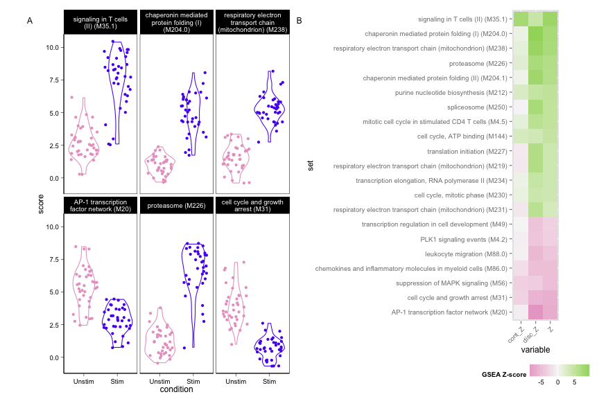 


### Figure 2 - Heatmap of Differentially Expressed Genes and Activated MAIT Module Scores

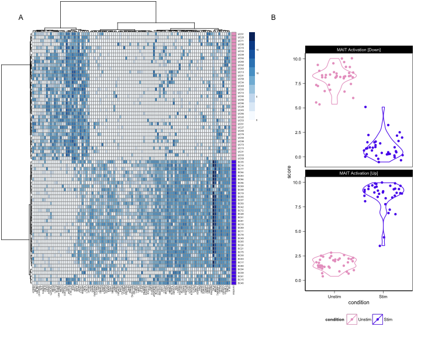 


<!-- ### Correlation of residuals across all cells using top 20 DE genes -->


<!-- ### Differentially expressed genes without Ngeneson -->


<!-- ### Visualization of correlation in residuals amongst genes -->


<!-- ### Visualization of correlation in residuals amongst genes (no ngeneson) -->


<!-- ### PCA of residuals (model with ngeneson) -->


```
## quartz_off_screen 
##                 2
```


```
## quartz_off_screen 
##                 2
```

### Figure 3 - Residual Correlations and PCA

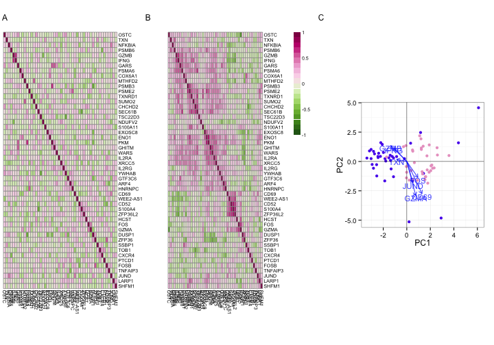 

<!-- ### Network estimation from residuals -->


<!-- ### Network estimates without ngeneson -->


<!-- ### Background correlation adjusting for ngeneson -->


### Supplementary Figure 3 - Residual Background Correlation

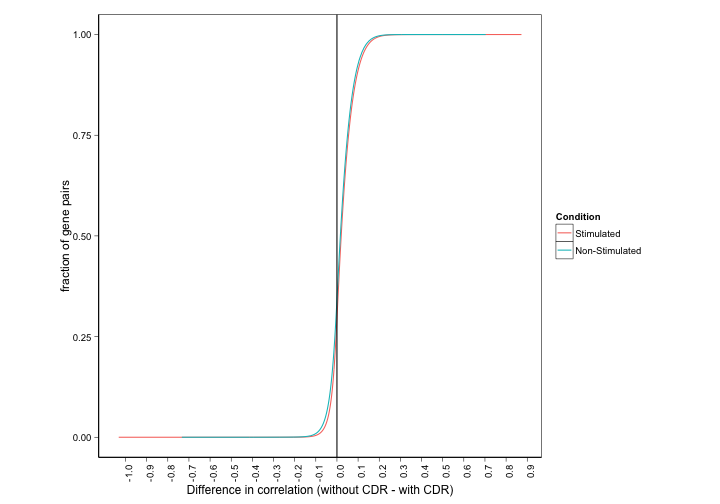 

<!--  ### Differential expression amongst Stimulated Cells for the outliers vs  non-outliers. -->


<!-- ### Differential expression amongst non-activated cells (Stimulated and  non-stimulated). -->


```
## quartz_off_screen 
##                 2
```


|egid   |chrmap  |symbol  |
|:------|:-------|:-------|
|1831   |Xq22.3  |TSC22D3 |
|5716   |Xq22.3  |PSMD10  |
|122704 |14q11.2 |MRPL52  |
|3002   |14q11.2 |GZMB    |
|51102  |1p35.3  |MECR    |
|93974  |1p35.3  |ATPIF1  |

### Supplementary Figure 9

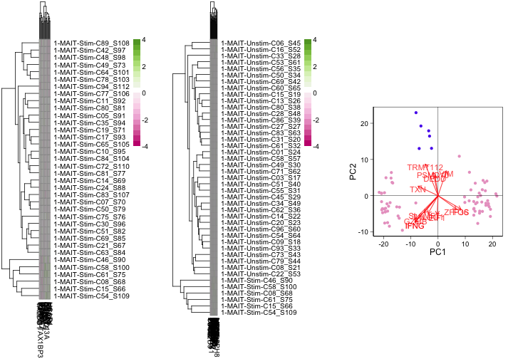 


### GSEA between non-stimulated and non-responding cells

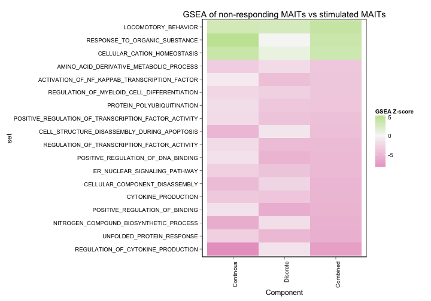 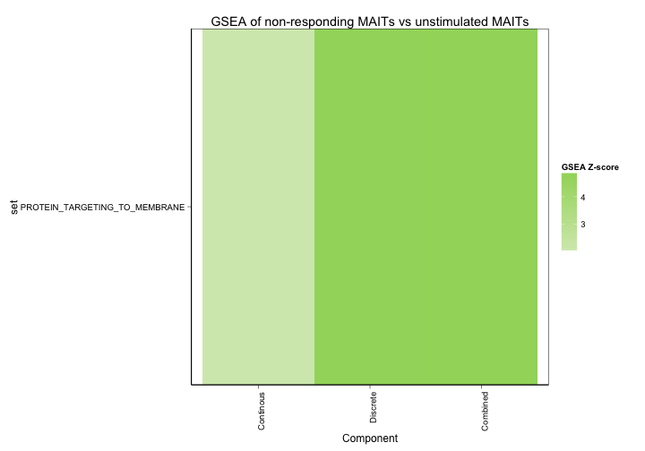 

<!-- ### ngeneson effect -->


### PCA plots for ngeneson effect


