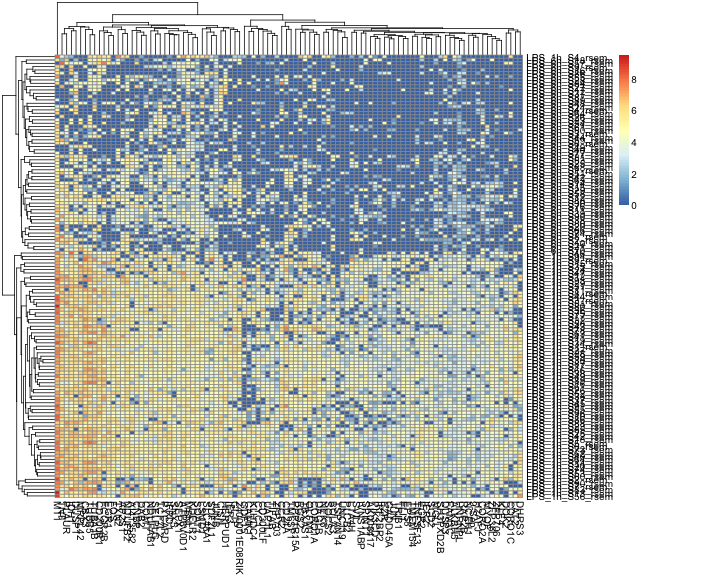
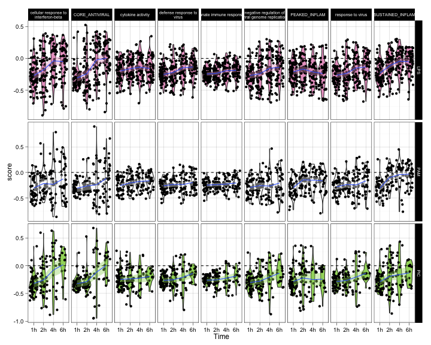
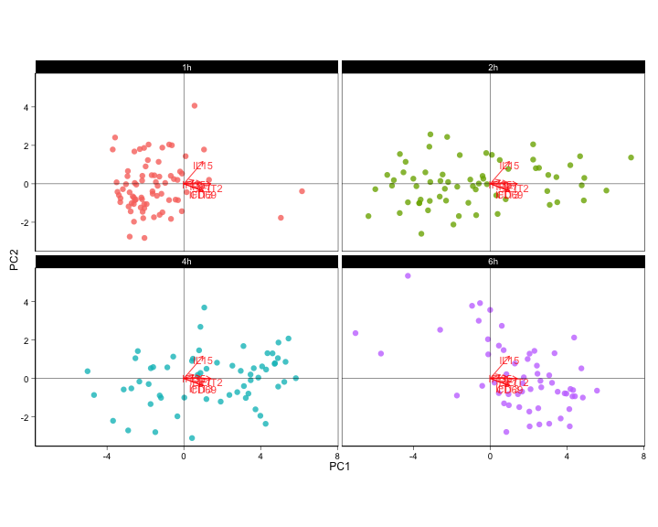
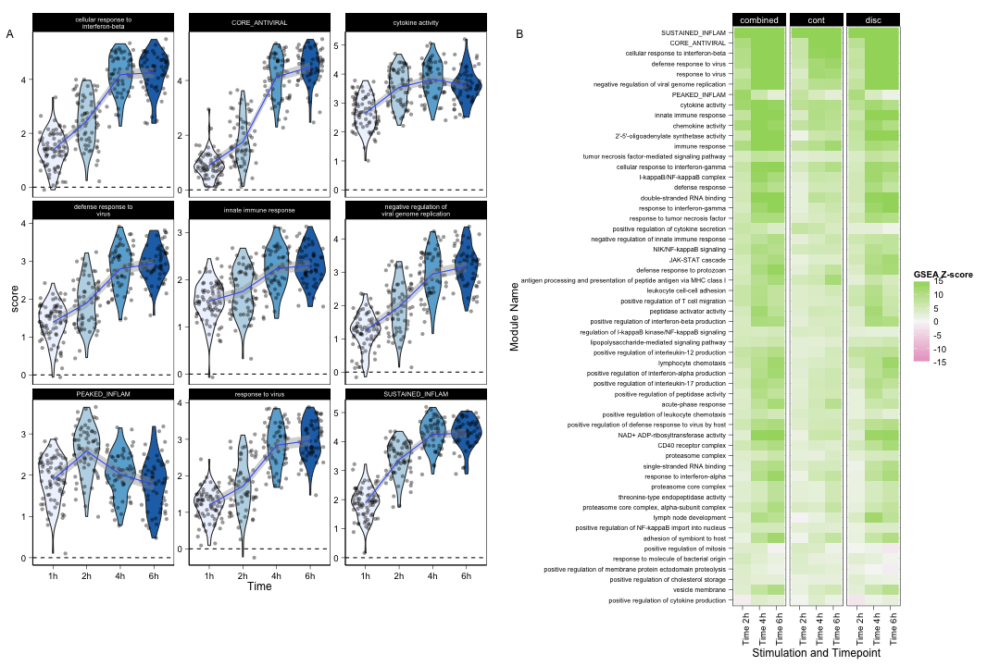
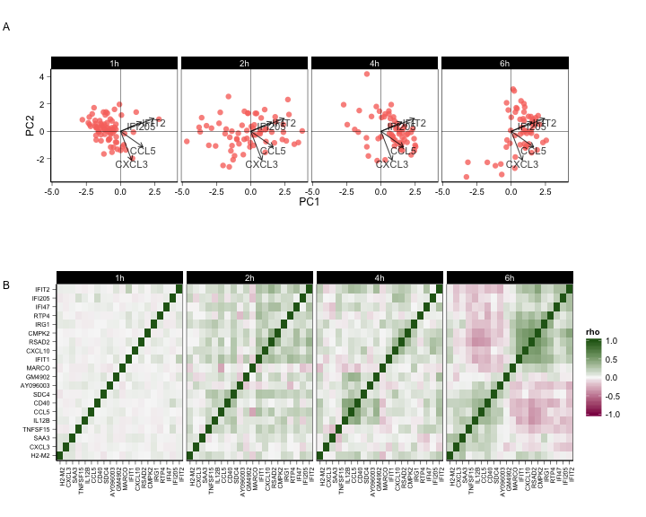
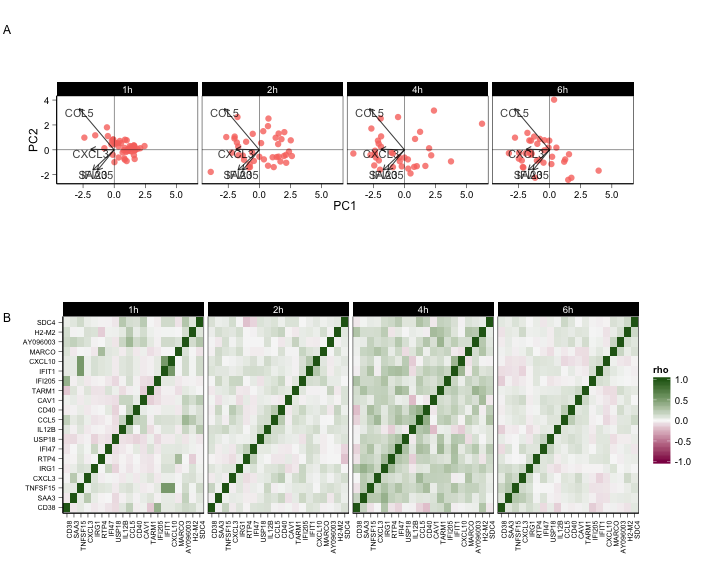
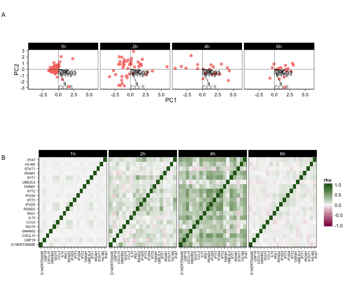

# mDC Cell Maturation


```
## Version Okay
```


```
## (0.00153,0.279]   (0.279,0.445]   (0.445,0.633]   (0.633,0.845] 
##        1.207297        1.207297        1.207297        1.207297 
##    (0.845,1.08]     (1.08,1.36]     (1.36,1.66]     (1.66,2.01] 
##        1.207297        1.207297        1.207297        1.207297 
##      (2.01,2.4]      (2.4,2.84]     (2.84,3.34]      (3.34,3.9] 
##        1.207297        1.207297        1.278617        1.294579 
##      (3.9,4.54]     (4.54,5.26]     (5.26,6.07]     (6.07,6.99] 
##        1.420138        1.420138        1.653459        2.730194 
##     (6.99,10.5] 
##        4.296567
```


### Fit zlm to stimulation and timepoint


### Test for any time effect in LPS

 

In the LPS stimulation, testing for any time effect, when adjusting for ngeneson we detect 1359 differentially expressed genes. When we don't adjust for ngeneson, we detect 1996 genes.


### Gene set enrichment analysis


```
##  [1] "(Intercept)"    "cngeneson"      "StimPAM"        "StimPIC"       
##  [5] "StimLPS:Time2h" "StimPAM:Time2h" "StimPIC:Time2h" "StimLPS:Time4h"
##  [9] "StimPAM:Time4h" "StimPIC:Time4h" "StimLPS:Time6h" "StimPAM:Time6h"
## [13] "StimPIC:Time6h"
```

```
##                     TERM             GOID include    coefficient    Stim
##    1:     CORE_ANTIVIRAL   CORE_ANTIVIRAL    TRUE StimLPS:Time2h StimLPS
##    2:     CORE_ANTIVIRAL   CORE_ANTIVIRAL    TRUE StimLPS:Time4h StimLPS
##    3:     CORE_ANTIVIRAL   CORE_ANTIVIRAL    TRUE StimLPS:Time6h StimLPS
##    4: proteasome complex       GO:0000502    TRUE StimLPS:Time2h StimLPS
##    5: proteasome complex       GO:0000502    TRUE StimLPS:Time4h StimLPS
##   ---                                                                   
## 1004:      PEAKED_INFLAM    PEAKED_INFLAM    TRUE StimLPS:Time4h StimLPS
## 1005:      PEAKED_INFLAM    PEAKED_INFLAM    TRUE StimLPS:Time6h StimLPS
## 1006:   SUSTAINED_INFLAM SUSTAINED_INFLAM    TRUE StimLPS:Time2h StimLPS
## 1007:   SUSTAINED_INFLAM SUSTAINED_INFLAM    TRUE StimLPS:Time4h StimLPS
## 1008:   SUSTAINED_INFLAM SUSTAINED_INFLAM    TRUE StimLPS:Time6h StimLPS
##       variable        value component
##    1:        P 2.255322e-28         P
##    2:        P 0.000000e+00         P
##    3:        P 0.000000e+00         P
##    4:        P 3.945754e-04         P
##    5:        P 1.710842e-06         P
##   ---                                
## 1004:   disc_Z 4.542155e+00      disc
## 1005:   disc_Z 1.407052e+00      disc
## 1006:   disc_Z 1.816686e+01      disc
## 1007:   disc_Z 3.384424e+01      disc
## 1008:   disc_Z 2.573727e+01      disc
```

```
##                     TERM             GOID include    coefficient    Stim
##    1:     CORE_ANTIVIRAL   CORE_ANTIVIRAL    TRUE StimLPS:Time2h StimLPS
##    2:     CORE_ANTIVIRAL   CORE_ANTIVIRAL    TRUE StimLPS:Time4h StimLPS
##    3:     CORE_ANTIVIRAL   CORE_ANTIVIRAL    TRUE StimLPS:Time6h StimLPS
##    4: proteasome complex       GO:0000502    TRUE StimLPS:Time2h StimLPS
##    5: proteasome complex       GO:0000502    TRUE StimLPS:Time4h StimLPS
##   ---                                                                   
## 1004:      PEAKED_INFLAM    PEAKED_INFLAM    TRUE StimLPS:Time4h StimLPS
## 1005:      PEAKED_INFLAM    PEAKED_INFLAM    TRUE StimLPS:Time6h StimLPS
## 1006:   SUSTAINED_INFLAM SUSTAINED_INFLAM    TRUE StimLPS:Time2h StimLPS
## 1007:   SUSTAINED_INFLAM SUSTAINED_INFLAM    TRUE StimLPS:Time4h StimLPS
## 1008:   SUSTAINED_INFLAM SUSTAINED_INFLAM    TRUE StimLPS:Time6h StimLPS
##       variable        value component
##    1:        P 2.255322e-28         P
##    2:        P 0.000000e+00         P
##    3:        P 0.000000e+00         P
##    4:        P 3.945754e-04         P
##    5:        P 1.710842e-06         P
##   ---                                
## 1004:   disc_Z 4.542155e+00      disc
## 1005:   disc_Z 1.407052e+00      disc
## 1006:   disc_Z 1.816686e+01      disc
## 1007:   disc_Z 3.384424e+01      disc
## 1008:   disc_Z 2.573727e+01      disc
```


### Residuals within significant modules

 

### PCA of core antiviral residuals
 

### Module scores


```
## quartz_off_screen 
##                 2
```

 


```
## quartz_off_screen 
##                 2
```

### Visualization of residual correlation over time in LPS


```
## Estimating optimal shrinkage intensity lambda (correlation matrix): 0.2831
```

```
## Estimating optimal shrinkage intensity lambda (correlation matrix): 0.7317
```

```
## Estimating optimal shrinkage intensity lambda (correlation matrix): 0.7317 
## 
## Estimating optimal shrinkage intensity lambda (correlation matrix): 0.3218 
## 
## Estimating optimal shrinkage intensity lambda (correlation matrix): 0.401 
## 
## Estimating optimal shrinkage intensity lambda (correlation matrix): 0.2831
```

### Correlations accounting for ngeneson


```
## [1] 377
```

```
## [1] 534
```

```
## [1] 193
```

```
## [1] 362
```

### PC plot of residuals in LPS


```
## quartz_off_screen 
##                 2
```

 


```
## quartz_off_screen 
##                 2
```

### Fit PAM and PIC


### Visualization of residual correlation over time in PAM


```
## Estimating optimal shrinkage intensity lambda (correlation matrix): 0.6551
```

```
## Estimating optimal shrinkage intensity lambda (correlation matrix): 0.4775
```

```
## Estimating optimal shrinkage intensity lambda (correlation matrix): 0.4775 
## 
## Estimating optimal shrinkage intensity lambda (correlation matrix): 0.6041 
## 
## Estimating optimal shrinkage intensity lambda (correlation matrix): 0.3993 
## 
## Estimating optimal shrinkage intensity lambda (correlation matrix): 0.6551
```


```
## quartz_off_screen 
##                 2
```

 

### Visualization of residual correlation over time in PIC


```
## Estimating optimal shrinkage intensity lambda (correlation matrix): 0.8058
```

```
## Estimating optimal shrinkage intensity lambda (correlation matrix): 0.8955
```

```
## Estimating optimal shrinkage intensity lambda (correlation matrix): 0.8955 
## 
## Estimating optimal shrinkage intensity lambda (correlation matrix): 0.5383 
## 
## Estimating optimal shrinkage intensity lambda (correlation matrix): 0.3324 
## 
## Estimating optimal shrinkage intensity lambda (correlation matrix): 0.8058
```


```
## quartz_off_screen 
##                 2
```

 


